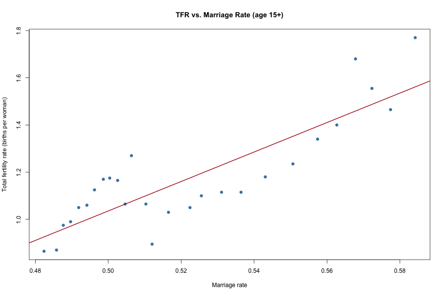
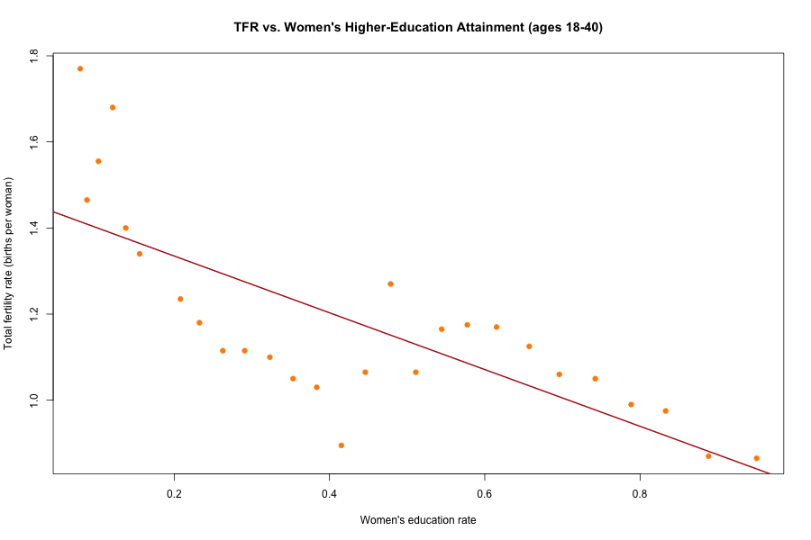
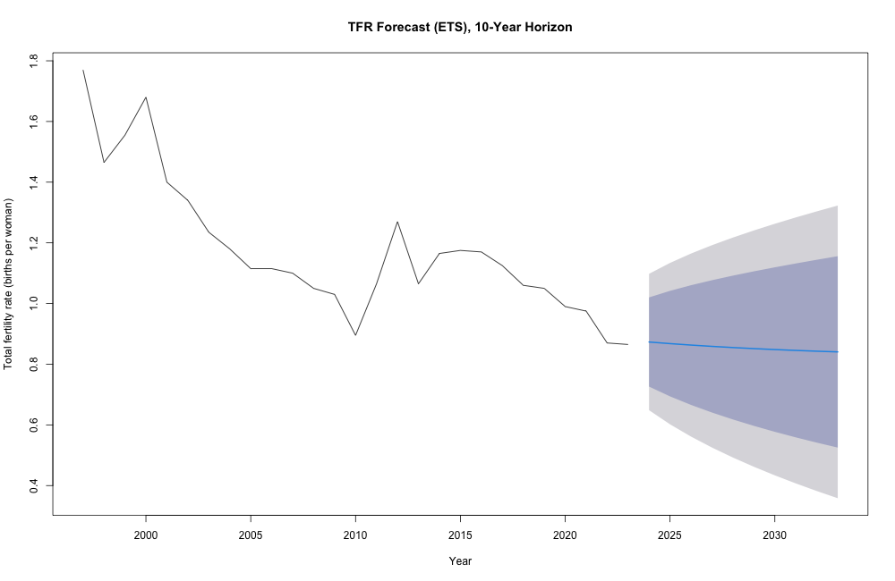
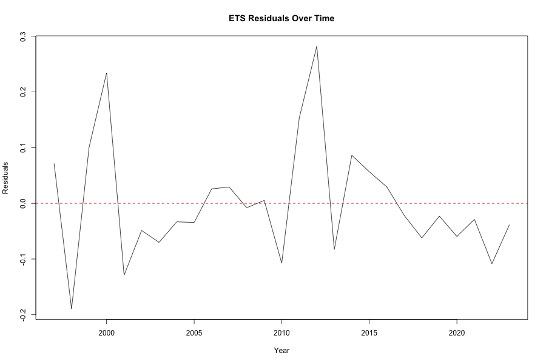
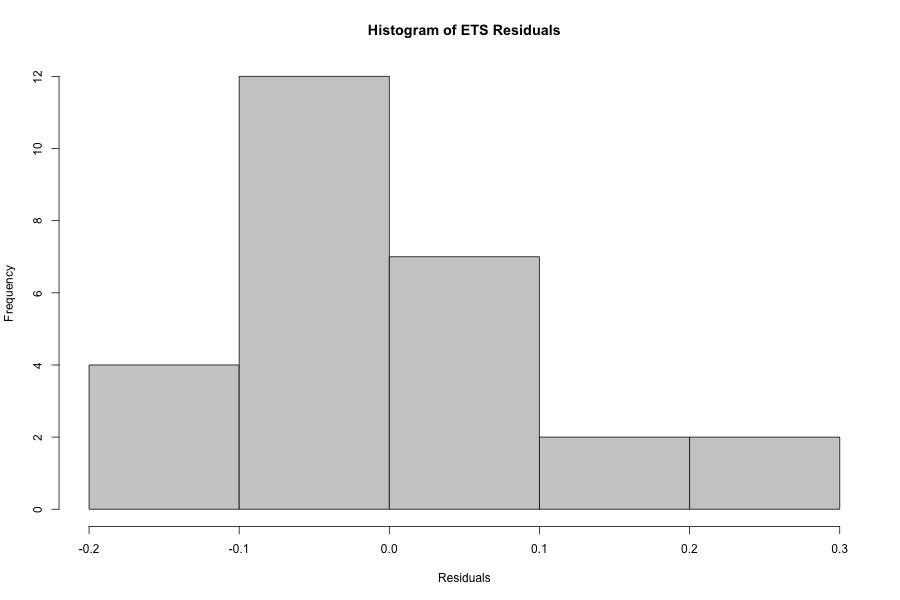

# Taiwan Fertility Rate Forecasting

Examining how women's higher-education attainment and marriage rates relate to Taiwan's total fertility rate (TFR), and forecasting where TFR is headed, using correlation analysis, simple linear regression, and ETS time-series smoothing in R.

## The Policy Question

**North Star metric:** Taiwan's total fertility rate (TFR) — births per woman.

TFR was 0.865 in 2023: well below the 2.1 replacement threshold and among the lowest in the world. Two factors get cited most often as drivers of the decline — women's rising participation in higher education, and a falling marriage rate. This project tests both directly: do they actually move with TFR in the data, by how much, and where is TFR headed if the trend continues?

This started as a group project (Team: Nikolas Perez Linggi [lead], Hsin Yi Peng, Sophia Lee, Julia Hung, Dominick Ortega); this repository is an independent R reproduction of the shared analysis, written and run end-to-end by Hsin Yi Peng.

## Dataset

`data/taiwan_fertility_data.csv` — 27 rows (1997–2023), sourced from Taiwan's Ministry of the Interior Statistical Yearbook.

| Column | Description |
|---|---|
| `year` | Calendar year |
| `marriage_rate` | Share of the population age 15+ that is married |
| `womens_edu_rate` | Share of women ages 18–40 with higher-education attainment |
| `childbearing_age_share` | Share of the female population that is of childbearing age (18–49) |
| `tfr` | Total fertility rate (births per woman) — target variable |

## Repository structure

```
.
├── analysis/
│   └── taiwan_fertility_analysis.R   # full pipeline: correlation -> regression -> ETS forecast -> diagnostics
├── data/
│   └── taiwan_fertility_data.csv
├── outputs/                          # generated on run: regression & forecast plots (PNG)
└── README.md
```

## Methodology

1. **Correlation check** — `marriage_rate` and `womens_edu_rate` are themselves highly correlated (r = -0.95, R² = 0.89), so a multiple regression of TFR on both together is unstable (multicollinearity). Each predictor is instead isolated into its own simple linear regression.
2. **Simple linear regression** — `tfr ~ marriage_rate` and `tfr ~ edu_rate`, evaluated on coefficient significance and adjusted R².
3. **Time-series forecasting** — TFR converted to an annual time series and fit with exponential smoothing (ETS, additive error + damped trend, matching the original model selection for this series), forecast 10 years out.
4. **Baseline comparison** — ETS training MAPE benchmarked against a naive (random walk) forecast and a simple linear trend, so forecast error is judged against a stated baseline rather than reported in isolation.
5. **Residual diagnostics** — Ljung-Box test for residual independence, Shapiro-Wilk test for normality, and a residuals-over-time plot to check for constant variance.

## How to run

```bash
git clone <this-repo-url>
cd taiwan-fertility-rate-forecasting
Rscript analysis/taiwan_fertility_analysis.R
```

Requires R (≥ 4.0) with packages: `forecast`, `tseries` — the script installs any that are missing on first run. Plots are written to `outputs/`.

## Findings

**Both hypothesized drivers move with TFR, and in the expected direction — but neither can be called out cleanly on its own.**

| Model | Coefficient | Adjusted R² | p-value |
|---|---|---|---|
| `tfr ~ marriage_rate` | 6.25 (higher marriage rate → higher TFR) | 0.72 | < 0.001 |
| `tfr ~ edu_rate` | -0.66 (higher women's education rate → lower TFR) | 0.56 | < 0.001 |

Both relationships are statistically significant: TFR rises with the marriage rate and falls as women's higher-education attainment rises. The marriage-rate model explains more of the variance (R² 0.72 vs. 0.56), suggesting nuptiality is the stronger single predictor of the two over this period.

**The honest caveat, and why it matters for policy:** marriage rate and education rate are themselves highly correlated (r = -0.95) — both are tracking the same multi-decade social shift, not moving independently. That's why they're modeled separately rather than together (see Methodology). It means this analysis can say "both move with TFR, marriage rate more strongly" but can't cleanly attribute the decline to one policy lever over the other — a policymaker reading this shouldn't conclude "target marriage rate, ignore education," since the data can't rule out that both are proxies for a common underlying trend.

<p>
  
  
</p>

**Forecast (ETS, damped trend)**

MAPE (training set): ~6.5%. Ljung-Box (p = 0.66) fails to reject independence of residuals; Shapiro-Wilk (p = 0.11) fails to reject normality — both support the model's assumptions holding reasonably well. The 10-year forecast projects TFR continuing its gradual decline before the damped trend flattens it out: on current trend, there's no statistical basis for expecting a rebound, which is itself the actionable takeaway for long-term workforce and economic planning.

**Baseline comparison** — "lower error" only means something relative to a stated baseline, so the ETS model is benchmarked against a naive (random walk) forecast and a simple linear trend, all evaluated the same way (training MAPE):

| Model | MAPE |
|---|---|
| ETS (damped trend) | 6.48% |
| Naive (random walk) | 7.43% |
| Linear trend | 9.66% |

ETS forecast error is **12.7% lower than the naive baseline** (and 32.9% lower than a plain linear trend) — the damped-trend structure is doing real work beyond "just extrapolate last year forward."



**Residual diagnostics**

<p>
  
  
</p>

## License

[MIT](LICENSE)
